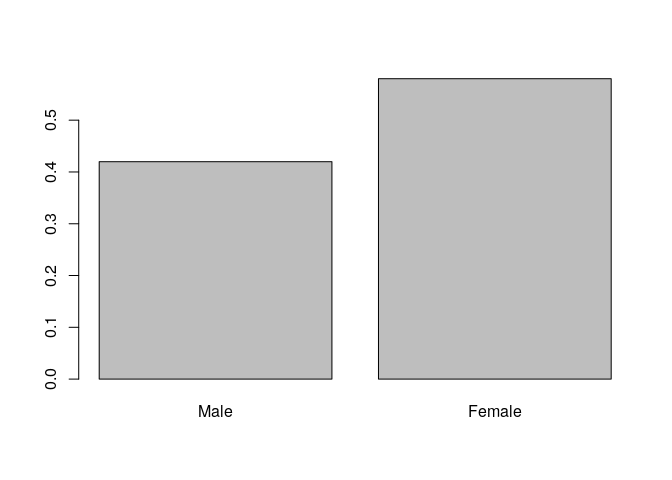
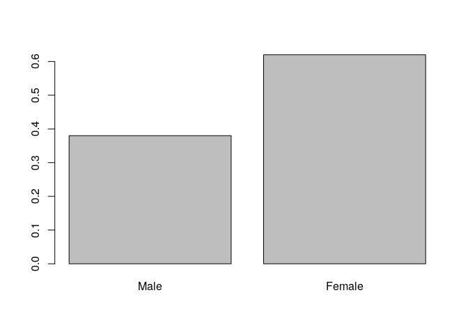

Exploring the BRFSS data
================

## Setup

### Load packages

``` r
library(ggplot2)
library(dplyr)
```

### Load data

``` r
load("brfss2013.RData")
```

## Part 1: Data

The Behavioral Risk Factor Surveillance System (BRFSS) is a
collaborative project between all of the states in the United States
(US) and participating US territories and the Centers for Disease
Control and Prevention (CDC).

BRFSS is an ongoing surveillance system designed to measure behavioral
risk factors for the non-institutionalized adult population (18 years of
age and older) residing in the US.

The BRFSS objective is to collect uniform, state-specific data on
preventive health practices and risk behaviors that are linked to
chronic diseases, injuries, and preventable infectious diseases that
affect the adult population. Factors assessed by the BRFSS in 2013
include tobacco use, HIV/AIDS knowledge and prevention, exercise,
immunization, health status, healthy days — health-related quality of
life, health care access, inadequate sleep, hypertension awareness,
cholesterol awareness, chronic health conditions, alcohol consumption,
fruits and vegetables consumption, arthritis burden, and seatbelt use.

Since 2011, BRFSS conducts both landline telephone- and cellular
telephone-based surveys. In conducting the BRFSS landline telephone
survey, interviewers collect data from a randomly selected adult in a
household. In conducting the cellular telephone version of the BRFSS
questionnaire, interviewers collect data from an adult who participates
by using a cellular telephone and resides in a private residence or
college housing.

It is an observational study and generalizability is ensured by random
sampling, but because it’s not an experiment there’s not causation.

## Part 2: Research questions

Following are the three research questions explored in this analysis.

**Research quesion 1:**

As first question, we are interested in exploring the relationship
between the sex and the average alcoholic drink per day in past 30 days.

**Research quesion 2:**

As second question, we explore the relationship between the sex, the
income level and the number of days he/she feels depressed in past 30
days.

**Research question 3:**

As third question, we are interested in the relationship between the
sex, the Running or Walking activity mostly do during the last month,
and the general health of the respondent.

## Part 3: Exploratory data analysis

**Research quesion 1:**

For the first question, we focus our analysis on two variables: sex of
respondent, avedrnk2 (during the past 30 days, on the days when the
person drank, about how many drinks did he/she drink on the average?).

``` r
brfss2013 %>% 
  select(sex, avedrnk2) %>% 
  str()
```

    ## 'data.frame':    491775 obs. of  2 variables:
    ##  $ sex     : Factor w/ 2 levels "Male","Female": 2 2 2 2 1 2 2 2 1 2 ...
    ##  $ avedrnk2: int  2 NA 4 2 2 NA 1 1 1 NA ...

Sex is a categorical variable with two values: 1 for male, 2 for female.
avedrnk2 is an numerical variable.

``` r
brfss2013 %>% 
  group_by(sex) %>% 
  summarise(count = n())
```

    ## # A tibble: 3 x 2
    ##   sex     count
    ## * <fct>   <int>
    ## 1 Male   201313
    ## 2 Female 290455
    ## 3 <NA>        7

Both sex and avedrnk2 have NA values, we will exclude them from our
analysis.

``` r
brfss2013 %>% 
  filter(!(is.na(sex)) & !(is.na(avedrnk2))) %>%
  group_by(sex) %>%
  summarise(mean = mean(avedrnk2), median = median(avedrnk2), sd = sd(avedrnk2), 
            min = min(avedrnk2), max = max(avedrnk2))
```

    ## # A tibble: 2 x 6
    ##   sex     mean median    sd   min   max
    ## * <fct>  <dbl>  <dbl> <dbl> <int> <int>
    ## 1 Male    2.65      2  2.78     1    76
    ## 2 Female  1.81      1  1.67     1    76

As we can see, the mean, the median and the standard deviation of
average drink consumption in the past 30 days seems to be higher in male
than female people.

Let’s do a side by side boxplot to visualize these results:

``` r
sex_alcohol_filtered <- brfss2013 %>%
  filter(!(is.na(sex)) & !(is.na(avedrnk2)))
ggplot(sex_alcohol_filtered, aes(x = factor(sex), y = avedrnk2)) +
  geom_boxplot()
```

<!-- -->

**Research quesion 2:**

In this case we explore the relationship between the sex, the income
level (income2 variable) and the number of days he/she feels depressed
in past 30 days (qlmentl2 variable).

``` r
brfss2013 %>%
  select(sex, income2, qlmentl2) %>% 
  str()
```

    ## 'data.frame':    491775 obs. of  3 variables:
    ##  $ sex     : Factor w/ 2 levels "Male","Female": 2 2 2 2 1 2 2 2 1 2 ...
    ##  $ income2 : Factor w/ 8 levels "Less than $10,000",..: 7 8 8 7 6 8 NA 6 8 4 ...
    ##  $ qlmentl2: int  30 2 2 6 NA NA NA NA NA NA ...

sex has two values, 1 for Male and 2 for Female. income2 has eight
values. qlmentl2 is an integer variable. In all of this variables there
are also some NAs that we will filter out.

Let’s count:

``` r
brfss2013 %>%
  filter(!(is.na(sex)) & !(is.na(qlmentl2))) %>%
  group_by(sex) %>% 
  summarise(count = n(), sum = sum(qlmentl2), mean = mean(qlmentl2), median = median(qlmentl2), sd = sd(qlmentl2), 
            min = min(qlmentl2), max = max(qlmentl2))
```

    ## # A tibble: 2 x 8
    ##   sex    count   sum  mean median    sd   min   max
    ## * <fct>  <int> <int> <dbl>  <dbl> <dbl> <int> <int>
    ## 1 Male     174   533  3.06      0  7.18     0    30
    ## 2 Female   316  1734  5.49      1  9.23     0    30

We can see that more women feel depressed, for more days than men on
average.

Let’s add the income level.

``` r
brfss2013 %>%
  filter(!(is.na(sex)) & !(is.na(income2)) & !(is.na(qlmentl2))) %>%
  group_by(sex, income2) %>% 
  summarise(count = n(), sum = sum(qlmentl2), mean = mean(qlmentl2), median = median(qlmentl2), sd = sd(qlmentl2), 
            min = min(qlmentl2), max = max(qlmentl2))
```

    ## `summarise()` has grouped output by 'sex'. You can override using the `.groups` argument.

    ## # A tibble: 16 x 9
    ## # Groups:   sex [2]
    ##    sex    income2           count   sum  mean median    sd   min   max
    ##    <fct>  <fct>             <int> <int> <dbl>  <dbl> <dbl> <int> <int>
    ##  1 Male   Less than $10,000     9    62  6.89    0   13.1      0    30
    ##  2 Male   Less than $15,000    19    89  4.68    0    8.23     0    30
    ##  3 Male   Less than $20,000     8    31  3.88    0   10.6      0    30
    ##  4 Male   Less than $25,000    15    56  3.73    0    7.97     0    30
    ##  5 Male   Less than $35,000    18    40  2.22    0    4.10     0    15
    ##  6 Male   Less than $50,000    24    78  3.25    0    8.80     0    30
    ##  7 Male   Less than $75,000    23    49  2.13    0    5.15     0    20
    ##  8 Male   $75,000 or more      30    46  1.53    0    4.13     0    15
    ##  9 Female Less than $10,000    30   248  8.27    3   10.6      0    30
    ## 10 Female Less than $15,000    24   229  9.54    4   11.8      0    30
    ## 11 Female Less than $20,000    24   181  7.54    3.5  9.76     0    30
    ## 12 Female Less than $25,000    32   253  7.91    2   11.7      0    30
    ## 13 Female Less than $35,000    22    54  2.45    0    5.14     0    20
    ## 14 Female Less than $50,000    31    57  1.84    0    2.75     0    10
    ## 15 Female Less than $75,000    36   101  2.81    0    5.96     0    30
    ## 16 Female $75,000 or more      46   165  3.59    0    7.18     0    30

It appears that, on average, female respondents spent more days feeling
depressed than men. However, for a level of income of 35,000$ and more,
the median of the female respondents is equal to 0 as the median of the
male respondents, suggesting that for some level of income they could be
the same on average.

**Research question 3:**

We explore the relationship between the sex, the Running or Walking
activity mostly do during the last month (exract11 variable), and the
general health of the respondent (genhlth).

``` r
brfss2013 %>%
  select(sex, exract11, genhlth) %>% 
  str()
```

    ## 'data.frame':    491775 obs. of  3 variables:
    ##  $ sex     : Factor w/ 2 levels "Male","Female": 2 2 2 2 1 2 2 2 1 2 ...
    ##  $ exract11: Factor w/ 75 levels "Active Gaming Devices (Wii Fit, Dance, Dance revolution)",..: NA 64 NA 64 NA 6 64 64 7 64 ...
    ##  $ genhlth : Factor w/ 5 levels "Excellent","Very good",..: 4 3 3 2 3 2 4 3 1 3 ...

These variables are all categorical. Also in this case, we’ll exclude
the NA values.

First of all, let’s check that Running and Walking activity are allowed
values:

``` r
levels(brfss2013$exract11)
```

    ##  [1] "Active Gaming Devices (Wii Fit, Dance, Dance revolution)"             
    ##  [2] "Aerobics video or class"                                              
    ##  [3] "Backpacking"                                                          
    ##  [4] "Badminton"                                                            
    ##  [5] "Basketball"                                                           
    ##  [6] "Bicycling machine exercise"                                           
    ##  [7] "Bicycling"                                                            
    ##  [8] "Boating (Canoeing, rowing, kayaking, sailing for pleasure or camping)"
    ##  [9] "Bowling"                                                              
    ## [10] "Boxing "                                                              
    ## [11] "Calisthenics"                                                         
    ## [12] "Canoeing/rowing in competition"                                       
    ## [13] "Carpentry"                                                            
    ## [14] "Dancing-ballet, ballroom, Latin, hip hop, etc"                        
    ## [15] "Elliptical/EFX machine exercise"                                      
    ## [16] "Fishing from river bank or boat"                                      
    ## [17] "Frisbee"                                                              
    ## [18] "Gardening (spading, weeding, digging, filling)"                       
    ## [19] "Golf (with motorized cart)"                                           
    ## [20] "Golf (without motorized cart)"                                        
    ## [21] "Handball"                                                             
    ## [22] "Hiking – cross-country"                                               
    ## [23] "Hockey"                                                               
    ## [24] "Horseback riding"                                                     
    ## [25] "Hunting large game – deer, elk"                                       
    ## [26] "Hunting small game – quail"                                           
    ## [27] "Inline Skating"                                                       
    ## [28] "Jogging"                                                              
    ## [29] "Lacrosse"                                                             
    ## [30] "Mountain climbing"                                                    
    ## [31] "Mowing lawn"                                                          
    ## [32] "Paddleball"                                                           
    ## [33] "Painting/papering house"                                              
    ## [34] "Pilates"                                                              
    ## [35] "Racquetball"                                                          
    ## [36] "Raking lawn"                                                          
    ## [37] "Running"                                                              
    ## [38] "Rock Climbing"                                                        
    ## [39] "Rope skipping"                                                        
    ## [40] "Rowing machine exercise"                                              
    ## [41] "Rugby"                                                                
    ## [42] "Scuba diving"                                                         
    ## [43] "Skateboarding"                                                        
    ## [44] "Skating – ice or roller"                                              
    ## [45] "Sledding, tobogganing"                                                
    ## [46] "Snorkeling"                                                           
    ## [47] "Snow blowing"                                                         
    ## [48] "Snow shoveling by hand"                                               
    ## [49] "Snow skiing"                                                          
    ## [50] "Snowshoeing"                                                          
    ## [51] "Soccer"                                                               
    ## [52] "Softball/Baseball"                                                    
    ## [53] "Squash"                                                               
    ## [54] "Stair climbing/Stair master"                                          
    ## [55] "Stream fishing in waders"                                             
    ## [56] "Surfing"                                                              
    ## [57] "Swimming"                                                             
    ## [58] "Swimming in laps"                                                     
    ## [59] "Table tennis"                                                         
    ## [60] "Tai Chi"                                                              
    ## [61] "Tennis"                                                               
    ## [62] "Touch football"                                                       
    ## [63] "Volleyball"                                                           
    ## [64] "Walking"                                                              
    ## [65] "Waterskiing"                                                          
    ## [66] "Weight lifting"                                                       
    ## [67] "Wrestling"                                                            
    ## [68] "Yoga"                                                                 
    ## [69] "Childcare"                                                            
    ## [70] "Farm/Ranch Work (caring for livestock, stacking hay, etc.)"           
    ## [71] "Household Activities (vacuuming, dusting, home repair, etc.)"         
    ## [72] "Karate/Martial Arts"                                                  
    ## [73] "Upper Body Cycle (wheelchair sports, ergometer, etc.)"                
    ## [74] "Yard work (cutting/gathering wood, trimming hedges, etc.)"            
    ## [75] "Other"

Let’s do some counts now. In general, how many men and women do physical
activity among those listed above?

``` r
filtered_exercise_dataset <- brfss2013 %>%
  select(sex, exract11, genhlth) %>%
  filter(!(is.na(sex)) & !(is.na(exract11)))
filtered_exercise_dataset %>%
  group_by(sex) %>%
  summarise(count = n()) %>%
  mutate(ratio=count/sum(count))
```

    ## # A tibble: 2 x 3
    ##   sex     count ratio
    ## * <fct>   <int> <dbl>
    ## 1 Male   138909 0.420
    ## 2 Female 191916 0.580

It appears that a little more over 58% of people that do exercise are
women.

``` r
barplot(prop.table(table(filtered_exercise_dataset$sex)))
```

<!-- -->

Let’s filter our dataset now.

``` r
exercise_sex_health <- brfss2013 %>%
  select(sex, exract11, genhlth) %>%
  filter(!(is.na(sex)) & (exract11 == 'Running' | exract11 == 'Walking') & !(is.na(genhlth)))
exercise_sex_health %>%
  group_by(sex) %>%
  summarise(count = n()) %>%
  mutate(ratio=count/sum(count))
```

    ## # A tibble: 2 x 3
    ##   sex     count ratio
    ## * <fct>   <int> <dbl>
    ## 1 Male    76973 0.380
    ## 2 Female 125563 0.620

And about 62% of people that do Running or Walking activity are women.

``` r
barplot(prop.table(table(exercise_sex_health$sex)))
```

<!-- -->

Let’s group by sex and type of activity now:

``` r
exercise_sex_health %>%
  group_by(sex, exract11) %>%
  summarise(count = n()) %>%
  mutate(ratio=count/sum(count))
```

    ## `summarise()` has grouped output by 'sex'. You can override using the `.groups` argument.

    ## # A tibble: 4 x 4
    ## # Groups:   sex [2]
    ##   sex    exract11  count  ratio
    ##   <fct>  <fct>     <int>  <dbl>
    ## 1 Male   Running   13031 0.169 
    ## 2 Male   Walking   63942 0.831 
    ## 3 Female Running   10090 0.0804
    ## 4 Female Walking  115473 0.920

Let’s group by sex, type of activity and general health now:

``` r
exercise_sex_health_grouped <- exercise_sex_health %>%
  group_by(sex, exract11, genhlth) %>%
  summarise(count = n()) %>%
  mutate(ratio = count/sum(count))
```

    ## `summarise()` has grouped output by 'sex', 'exract11'. You can override using the `.groups` argument.

``` r
exercise_sex_health_grouped
```

    ## # A tibble: 20 x 5
    ## # Groups:   sex, exract11 [4]
    ##    sex    exract11 genhlth   count   ratio
    ##    <fct>  <fct>    <fct>     <int>   <dbl>
    ##  1 Male   Running  Excellent  4693 0.360  
    ##  2 Male   Running  Very good  5313 0.408  
    ##  3 Male   Running  Good       2555 0.196  
    ##  4 Male   Running  Fair        424 0.0325 
    ##  5 Male   Running  Poor         46 0.00353
    ##  6 Male   Walking  Excellent  9319 0.146  
    ##  7 Male   Walking  Very good 21419 0.335  
    ##  8 Male   Walking  Good      21660 0.339  
    ##  9 Male   Walking  Fair       8532 0.133  
    ## 10 Male   Walking  Poor       3012 0.0471 
    ## 11 Female Running  Excellent  4124 0.409  
    ## 12 Female Running  Very good  4036 0.4    
    ## 13 Female Running  Good       1643 0.163  
    ## 14 Female Running  Fair        249 0.0247 
    ## 15 Female Running  Poor         38 0.00377
    ## 16 Female Walking  Excellent 20672 0.179  
    ## 17 Female Walking  Very good 41562 0.360  
    ## 18 Female Walking  Good      35009 0.303  
    ## 19 Female Walking  Fair      13828 0.120  
    ## 20 Female Walking  Poor       4402 0.0381

Looking at the ratio by sex and type of activity, we can compare women
and men general health.
