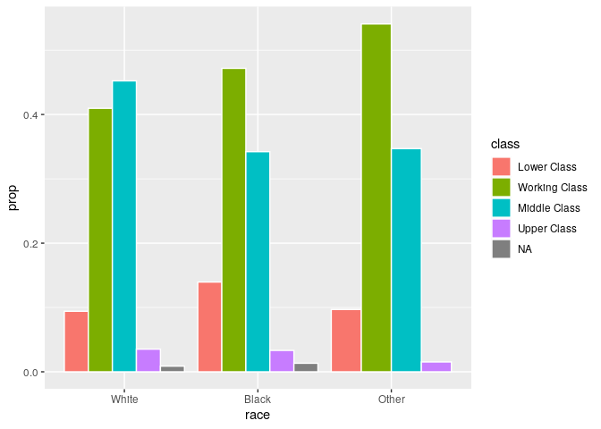

Statistical inference with the GSS data
================

## Setup

### Load packages

``` r
library(ggplot2)
library(dplyr)
library(statsr)
```

### Load data

``` r
load("gss.Rdata")
```

## Part 1: Data

Each row of the data set represents the interview with a person. The
interviews are carried out face-to-face by means of a questionnaire.

The data come from the General Social Surveys (GSS), which gathers data
on contemporary American society in order to monitor and explain trends
and constants in attitudes, behaviors, and attributes.

The General Social Surveys have been conducted in 1972, 1973, 1974,
1975, 1976, 1977, 1978, 1980, 1982, 1983, 1984, 1985, 1986, 1987, 1988,
1989, 1990, 1991, 1993, 1994, 1996, 1998, 2000, 2002, 2004, 2006, 2008,
2010, 2012, 2014, 2016, and 2018.

In this study, the cumulative data set merges all surveys from 1972 to
2012 into a single file, for a total of 57,061 interviews.

Each survey from 1972 to 2004 was an independently drawn sample of
English-speaking persons 18 years of age or over, living in
non-institutional arrangements within the United States. Starting in
2006 Spanish-speakers were added to the target population.

Block quota sampling was used in 1972, 1973, and 1974 surveys and for
half of the 1975 and 1976 surveys, and thus sample group members are
selected non-randomly. Full probability sampling was employed in half of
the 1975 and 1976 surveys and the 1977, 1978, 1980, 1982-1991,
1993-1998, 2000, 2002, 2004, 2006, 2008, 2010, 2012, 2014, 2016, and
2018 surveys. The full probability sample design leads to a random
construction of the samples.

As a first step in the analysis, we should take a look at the variables
in the data set:

``` r
str(gss)
```

    ## 'data.frame':    57061 obs. of  114 variables:
    ##  $ caseid  : int  1 2 3 4 5 6 7 8 9 10 ...
    ##  $ year    : int  1972 1972 1972 1972 1972 1972 1972 1972 1972 1972 ...
    ##  $ age     : int  23 70 48 27 61 26 28 27 21 30 ...
    ##  $ sex     : Factor w/ 2 levels "Male","Female": 2 1 2 2 2 1 1 1 2 2 ...
    ##  $ race    : Factor w/ 3 levels "White","Black",..: 1 1 1 1 1 1 1 1 2 2 ...
    ##  $ hispanic: Factor w/ 28 levels "Not Hispanic",..: NA NA NA NA NA NA NA NA NA NA ...
    ##  $ uscitzn : Factor w/ 4 levels "A U.S. Citizen",..: NA NA NA NA NA NA NA NA NA NA ...
    ##  $ educ    : int  16 10 12 17 12 14 13 16 12 12 ...
    ##  $ paeduc  : int  10 8 8 16 8 18 16 16 12 10 ...
    ##  $ maeduc  : int  NA 8 8 12 8 19 12 14 12 7 ...
    ##  $ speduc  : int  NA 12 11 20 12 NA NA NA NA 11 ...
    ##  $ degree  : Factor w/ 5 levels "Lt High School",..: 4 1 2 4 2 2 2 4 2 2 ...
    ##  $ vetyears: Factor w/ 5 levels "None","Less Than 2 Yrs",..: NA NA NA NA NA NA NA NA NA NA ...
    ##  $ sei     : num  NA NA NA NA NA NA NA NA NA NA ...
    ##  $ wrkstat : Factor w/ 8 levels "Working Fulltime",..: 1 5 2 1 7 1 1 1 2 1 ...
    ##  $ wrkslf  : Factor w/ 2 levels "Self-Employed",..: 2 2 2 2 2 2 2 2 2 2 ...
    ##  $ marital : Factor w/ 5 levels "Married","Widowed",..: 5 1 1 1 1 5 3 5 5 1 ...
    ##  $ spwrksta: Factor w/ 8 levels "Working Fulltime",..: NA 7 1 1 3 NA NA NA NA 1 ...
    ##  $ sibs    : int  3 4 5 5 2 1 7 1 2 7 ...
    ##  $ childs  : int  0 5 4 0 2 0 2 0 2 4 ...
    ##  $ agekdbrn: int  NA NA NA NA NA NA NA NA NA NA ...
    ##  $ incom16 : Factor w/ 6 levels "Far Below Average",..: 3 4 3 3 2 3 4 3 3 1 ...
    ##  $ born    : Factor w/ 2 levels "Yes","No": NA NA NA NA NA NA NA NA NA NA ...
    ##  $ parborn : Factor w/ 9 levels "Both In U.S",..: NA NA NA NA NA NA NA NA NA NA ...
    ##  $ granborn: int  NA NA NA NA NA NA NA NA NA NA ...
    ##  $ income06: Factor w/ 26 levels "Under $1 000",..: NA NA NA NA NA NA NA NA NA NA ...
    ##  $ coninc  : int  25926 33333 33333 41667 69444 60185 50926 18519 3704 25926 ...
    ##  $ region  : Factor w/ 9 levels "New England",..: 3 3 3 3 3 3 3 3 7 7 ...
    ##  $ partyid : Factor w/ 8 levels "Strong Democrat",..: 3 2 4 2 1 3 3 3 1 1 ...
    ##  $ polviews: Factor w/ 7 levels "Extremely Liberal",..: NA NA NA NA NA NA NA NA NA NA ...
    ##  $ relig   : Factor w/ 13 levels "Protestant","Catholic",..: 3 2 1 5 1 1 2 3 1 1 ...
    ##  $ attend  : Factor w/ 9 levels "Never","Lt Once A Year",..: 3 8 5 NA NA 3 8 NA 4 9 ...
    ##  $ natspac : Factor w/ 3 levels "Too Little","About Right",..: NA NA NA NA NA NA NA NA NA NA ...
    ##  $ natenvir: Factor w/ 3 levels "Too Little","About Right",..: NA NA NA NA NA NA NA NA NA NA ...
    ##  $ natheal : Factor w/ 3 levels "Too Little","About Right",..: NA NA NA NA NA NA NA NA NA NA ...
    ##  $ natcity : Factor w/ 3 levels "Too Little","About Right",..: NA NA NA NA NA NA NA NA NA NA ...
    ##  $ natcrime: Factor w/ 3 levels "Too Little","About Right",..: NA NA NA NA NA NA NA NA NA NA ...
    ##  $ natdrug : Factor w/ 3 levels "Too Little","About Right",..: NA NA NA NA NA NA NA NA NA NA ...
    ##  $ nateduc : Factor w/ 3 levels "Too Little","About Right",..: NA NA NA NA NA NA NA NA NA NA ...
    ##  $ natrace : Factor w/ 3 levels "Too Little","About Right",..: NA NA NA NA NA NA NA NA NA NA ...
    ##  $ natarms : Factor w/ 3 levels "Too Little","About Right",..: NA NA NA NA NA NA NA NA NA NA ...
    ##  $ nataid  : Factor w/ 3 levels "Too Little","About Right",..: NA NA NA NA NA NA NA NA NA NA ...
    ##  $ natfare : Factor w/ 3 levels "Too Little","About Right",..: NA NA NA NA NA NA NA NA NA NA ...
    ##  $ natroad : Factor w/ 3 levels "Too Little","About Right",..: NA NA NA NA NA NA NA NA NA NA ...
    ##  $ natsoc  : Factor w/ 3 levels "Too Little","About Right",..: NA NA NA NA NA NA NA NA NA NA ...
    ##  $ natmass : Factor w/ 3 levels "Too Little","About Right",..: NA NA NA NA NA NA NA NA NA NA ...
    ##  $ natpark : Factor w/ 3 levels "Too Little","About Right",..: NA NA NA NA NA NA NA NA NA NA ...
    ##  $ confinan: Factor w/ 3 levels "A Great Deal",..: NA NA NA NA NA NA NA NA NA NA ...
    ##  $ conbus  : Factor w/ 3 levels "A Great Deal",..: NA NA NA NA NA NA NA NA NA NA ...
    ##  $ conclerg: Factor w/ 3 levels "A Great Deal",..: NA NA NA NA NA NA NA NA NA NA ...
    ##  $ coneduc : Factor w/ 3 levels "A Great Deal",..: NA NA NA NA NA NA NA NA NA NA ...
    ##  $ confed  : Factor w/ 3 levels "A Great Deal",..: NA NA NA NA NA NA NA NA NA NA ...
    ##  $ conlabor: Factor w/ 3 levels "A Great Deal",..: NA NA NA NA NA NA NA NA NA NA ...
    ##  $ conpress: Factor w/ 3 levels "A Great Deal",..: NA NA NA NA NA NA NA NA NA NA ...
    ##  $ conmedic: Factor w/ 3 levels "A Great Deal",..: NA NA NA NA NA NA NA NA NA NA ...
    ##  $ contv   : Factor w/ 3 levels "A Great Deal",..: NA NA NA NA NA NA NA NA NA NA ...
    ##  $ conjudge: Factor w/ 3 levels "A Great Deal",..: NA NA NA NA NA NA NA NA NA NA ...
    ##  $ consci  : Factor w/ 3 levels "A Great Deal",..: NA NA NA NA NA NA NA NA NA NA ...
    ##  $ conlegis: Factor w/ 3 levels "A Great Deal",..: NA NA NA NA NA NA NA NA NA NA ...
    ##  $ conarmy : Factor w/ 3 levels "A Great Deal",..: NA NA NA NA NA NA NA NA NA NA ...
    ##  $ joblose : Factor w/ 5 levels "Very Likely",..: NA NA NA NA NA NA NA NA NA NA ...
    ##  $ jobfind : Factor w/ 3 levels "Very Easy","Somewhat Easy",..: NA NA NA NA NA NA NA NA NA NA ...
    ##  $ satjob  : Factor w/ 4 levels "Very Satisfied",..: 3 NA 2 1 NA 2 1 3 2 2 ...
    ##  $ richwork: Factor w/ 2 levels "Continue Working",..: NA NA NA NA NA NA NA NA NA NA ...
    ##  $ jobinc  : Factor w/ 5 levels "Most Impt","Second",..: NA NA NA NA NA NA NA NA NA NA ...
    ##  $ jobsec  : Factor w/ 5 levels "Most Impt","Second",..: NA NA NA NA NA NA NA NA NA NA ...
    ##  $ jobhour : Factor w/ 5 levels "Most Impt","Second",..: NA NA NA NA NA NA NA NA NA NA ...
    ##  $ jobpromo: Factor w/ 5 levels "Most Impt","Second",..: NA NA NA NA NA NA NA NA NA NA ...
    ##  $ jobmeans: Factor w/ 5 levels "Most Impt","Second",..: NA NA NA NA NA NA NA NA NA NA ...
    ##  $ class   : Factor w/ 5 levels "Lower Class",..: 3 3 2 3 2 3 3 2 2 2 ...
    ##  $ rank    : int  NA NA NA NA NA NA NA NA NA NA ...
    ##  $ satfin  : Factor w/ 3 levels "Satisfied","More Or Less",..: 3 2 1 3 1 2 2 3 2 3 ...
    ##  $ finalter: Factor w/ 3 levels "Better","Worse",..: 1 3 1 3 1 1 1 1 2 3 ...
    ##  $ finrela : Factor w/ 5 levels "Far Below Average",..: 3 4 3 3 4 4 4 3 3 2 ...
    ##  $ unemp   : Factor w/ 2 levels "Yes","No": NA NA NA NA NA NA NA NA NA NA ...
    ##  $ govaid  : Factor w/ 2 levels "Yes","No": NA NA NA NA NA NA NA NA NA NA ...
    ##  $ getaid  : Factor w/ 2 levels "Yes","No": NA NA NA NA NA NA NA NA NA NA ...
    ##  $ union   : Factor w/ 4 levels "R Belongs","Spouse Belongs",..: NA NA NA NA NA NA NA NA NA NA ...
    ##  $ getahead: Factor w/ 4 levels "Hard Work","Both Equally",..: NA NA NA NA NA NA NA NA NA NA ...
    ##  $ parsol  : Factor w/ 5 levels "Much Better",..: NA NA NA NA NA NA NA NA NA NA ...
    ##  $ kidssol : Factor w/ 6 levels "Much Better",..: NA NA NA NA NA NA NA NA NA NA ...
    ##  $ abdefect: Factor w/ 2 levels "Yes","No": 1 1 1 2 1 1 1 1 1 1 ...
    ##  $ abnomore: Factor w/ 2 levels "Yes","No": 1 2 1 2 1 1 2 1 2 2 ...
    ##  $ abhlth  : Factor w/ 2 levels "Yes","No": 1 1 1 1 1 1 1 1 1 1 ...
    ##  $ abpoor  : Factor w/ 2 levels "Yes","No": 1 2 1 1 1 1 2 1 2 1 ...
    ##  $ abrape  : Factor w/ 2 levels "Yes","No": 1 1 1 1 1 1 1 1 NA 1 ...
    ##  $ absingle: Factor w/ 2 levels "Yes","No": 1 1 1 1 1 1 1 1 2 2 ...
    ##  $ abany   : Factor w/ 2 levels "Yes","No": NA NA NA NA NA NA NA NA NA NA ...
    ##  $ pillok  : Factor w/ 4 levels "Strongly Agree",..: NA NA NA NA NA NA NA NA NA NA ...
    ##  $ sexeduc : Factor w/ 3 levels "Favor","Oppose",..: NA NA NA NA NA NA NA NA NA NA ...
    ##  $ divlaw  : Factor w/ 3 levels "Easier","More Difficult",..: NA NA NA NA NA NA NA NA NA NA ...
    ##  $ premarsx: Factor w/ 5 levels "Always Wrong",..: 4 1 1 1 3 3 4 3 4 1 ...
    ##  $ teensex : Factor w/ 5 levels "Always Wrong",..: NA NA NA NA NA NA NA NA NA NA ...
    ##  $ xmarsex : Factor w/ 5 levels "Always Wrong",..: NA NA NA NA NA NA NA NA NA NA ...
    ##  $ homosex : Factor w/ 5 levels "Always Wrong",..: NA NA NA NA NA NA NA NA NA NA ...
    ##  $ suicide1: Factor w/ 2 levels "Yes","No": NA NA NA NA NA NA NA NA NA NA ...
    ##  $ suicide2: Factor w/ 2 levels "Yes","No": NA NA NA NA NA NA NA NA NA NA ...
    ##  $ suicide3: Factor w/ 2 levels "Yes","No": NA NA NA NA NA NA NA NA NA NA ...
    ##  $ suicide4: Factor w/ 2 levels "Yes","No": NA NA NA NA NA NA NA NA NA NA ...
    ##   [list output truncated]

Our analysis will be focused on the year 2012:

``` r
us12 <- gss %>% 
    filter(gss$year == 2012)
```

## Part 2: Research question

The question we want to answer is: “In 2012, does that appear to be a
relationship between the race of each respondent and the social class in
which they identify themselves?”.

We recall tha in the survery the race is a choice between **white**,
**black**, **other**, while the social class in which the respondent
identifies is a choice between the **lower class**, the **working
class**, the **middle class**, the **upper class**, **no class**, or
**NA**.

## Part 3: Exploratory data analysis

We count how many interviews were conducted in 2012

``` r
nrow(us12)
```

    ## [1] 1974

Given the large number of columns in the data set, let’s focus only on
those that interest us, race and class, which are two categorical
columns.

Let’s use some summary statistics to describe them:

``` r
cols <- c("race", "class")
summary(us12[cols])
```

    ##     race                class    
    ##  White:1477   Lower Class  :200  
    ##  Black: 301   Working Class:853  
    ##  Other: 196   Middle Class :839  
    ##               Upper Class  : 65  
    ##               No Class     :  0  
    ##               NA's         : 17

As you can see, we have 17 unknown values for the social class, while we
have 0 elements for the No Class. We will exclude both the unavailable
NA data and the entire No Class.

Let’s now check the number of people of each social class, within the
various races, together with the percentages:

``` r
us12_freq <- us12 %>%
     count(race, class) %>%
     group_by(race) %>%
     mutate(prop = prop.table(n))
us12_freq
```

    ## # A tibble: 14 x 4
    ## # Groups:   race [3]
    ##    race  class             n    prop
    ##    <fct> <fct>         <int>   <dbl>
    ##  1 White Lower Class     139 0.0941 
    ##  2 White Working Class   605 0.410  
    ##  3 White Middle Class    668 0.452  
    ##  4 White Upper Class      52 0.0352 
    ##  5 White <NA>             13 0.00880
    ##  6 Black Lower Class      42 0.140  
    ##  7 Black Working Class   142 0.472  
    ##  8 Black Middle Class    103 0.342  
    ##  9 Black Upper Class      10 0.0332 
    ## 10 Black <NA>              4 0.0133 
    ## 11 Other Lower Class      19 0.0969 
    ## 12 Other Working Class   106 0.541  
    ## 13 Other Middle Class     68 0.347  
    ## 14 Other Upper Class       3 0.0153

We use a bar plot graph to represent the frequencies of each social
class within each race

``` r
ggplot(us12_freq, aes(x = race, y = prop))+
     geom_bar(
         aes(fill = class), stat = "identity", color = "white",
         position = position_dodge(0.9)
     )
```

<!-- -->

From this graph, we can see, for example, that within whites the working
class is less relevant than the middle class. Among blacks and the other
race, however, the working class is more relevant than the middle class.

We generate a contingency table that is useful to analyse the
relationship between race and social class

``` r
observed <- as.data.frame.matrix(addmargins(table(us12$class,us12$race),c(1,2)))
observed
```

    ##               White Black Other  Sum
    ## Lower Class     139    42    19  200
    ## Working Class   605   142   106  853
    ## Middle Class    668   103    68  839
    ## Upper Class      52    10     3   65
    ## No Class          0     0     0    0
    ## Sum            1464   297   196 1957

As you can see, we have excluded NA classes. We also remove the “No
Class” because it has no elements

``` r
observed <- observed[!(row.names(observed) %in% c("No Class")),]
observed
```

    ##               White Black Other  Sum
    ## Lower Class     139    42    19  200
    ## Working Class   605   142   106  853
    ## Middle Class    668   103    68  839
    ## Upper Class      52    10     3   65
    ## Sum            1464   297   196 1957

## Part 4: Inference

We will use a chi-square independence test to assess the independence
between the two categorical variables race and social class. We cannot
calculate a confidence interval because we want to compare two
categorical variables, not averages or proportions.

### State hypothesis

\[
\begin{aligned}
H_0 &= \text{nothing going on} = \text{Race and social class are independent. The rate of belonging to a social class does not vary according to race.} \\
H_A &= \text{something going on} = \text{Race and social class are dependent. The rate of belonging to a social class varies according to race.}
\end{aligned}
\]

### Check conditions

1.  Independence:
      - random sampling and assignment. Ok for the discussion in part 1
        on data
      - we’re sampling without replacement and the sample size n = 1957
        \< 10% total American population in 2012
      - each case only contributes to one cell in the table. Yes because
        each intervieweed has a single race and a single social class
2.  Sample size: each particular scenario (cell) must have at least 5
    expected cases. It’s verified, we’ll see in a little while

### Perform inference

Assuming \(H_0\) true, so if in fact race and class are independent, how
many of the white people, black people, other people would we expect to
be in the lower, working, middle, upper and no class?

We build the matrix of expected values under the assumption that \(H_0\)
is true, using the formula:

\[
\text{expected value (position i,j)} = \frac{\text{row i total} \cdot \text{column j total}}{\text{table total}}
\]

Let’s do the calculations:

``` r
lower_rate <- 200 / 1957
working_rate <- 853 / 1957
middle_rate <- 839 / 1957
upper_rate <- 65 / 1957
class_rates <- c(lower_rate, working_rate, middle_rate, upper_rate)

races_count = c(1464,297,196)

num_classes = length(class_rates)
num_races = ncol(observed)-1

expected <- matrix(NA, nrow = num_classes, ncol = num_races)
for (i in 1:num_classes) {
  for (j in 1:num_races) {
    expected[i,j] <- races_count[j]*class_rates[i]
  }
}

expected = as.data.frame.matrix(expected)
row.names(expected) <- row.names(observed)[1:num_classes]
names(expected) = names(observed)[1:num_races]
expected
```

    ##                   White      Black     Other
    ## Lower Class   149.61676  30.352580 20.030659
    ## Working Class 638.11548 129.453756 85.430761
    ## Middle Class  627.64231 127.329075 84.028615
    ## Upper Class    48.62545   9.864589  6.509964

We calculate the chi-square test statistics

``` r
observed <- observed[,-4]
observed <- head(observed,-1)
diff <- (observed - expected)^2 / expected
diff
```

    ##                   White       Black      Other
    ## Lower Class   0.7533621 4.469550177 0.05303162
    ## Working Class 1.7185529 1.215941893 4.95247345
    ## Middle Class  2.5950181 4.648615373 3.05748828
    ## Upper Class   0.2341903 0.001858793 1.89246031

We calculate the p-value

``` r
chi_square_stat = sum(diff)
chi_square_stat
```

    ## [1] 25.59254

``` r
deg_freedom = (num_classes-1)*(num_races-1)

pval = pchisq(chi_square_stat, deg_freedom, lower.tail = FALSE)
pval
```

    ## [1] 0.0002651057

Using as significance level \(0.05\), since the p-value found is about
\(0.0003\) and is less than \(0.05\), we can reject the null \(H_0\)
hypothesis and conclude that the data give convincing evidence that race
and social class are associated.

### Interpret results

Since this is an observational study, we cannot conclude anything on the
causality between the two variables. It could be that the belonging to a
social class is influenced by other variables that we are not
considering.

We cannot therefore conclude that there is a causal relationship between
the two variables, race and social class.
