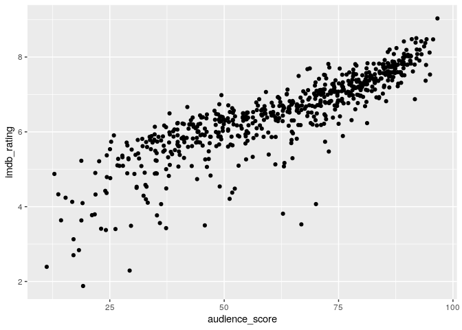
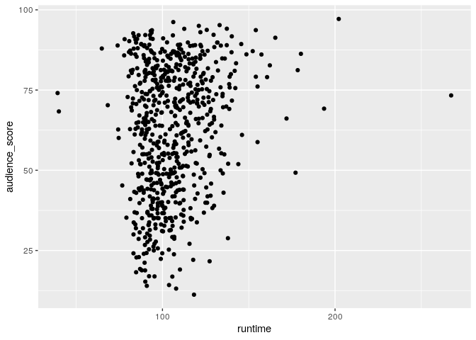
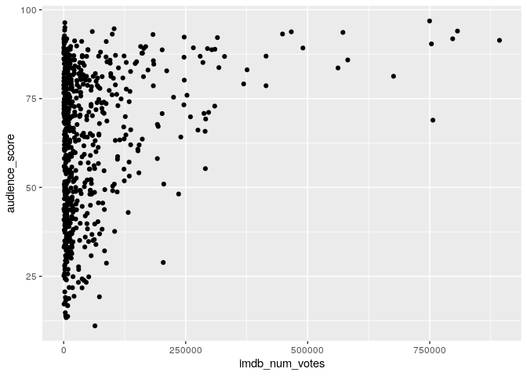
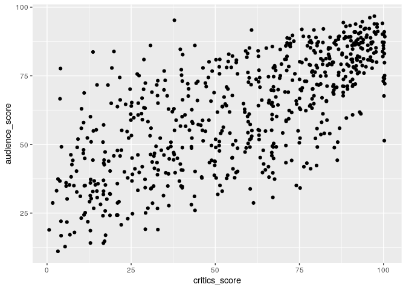
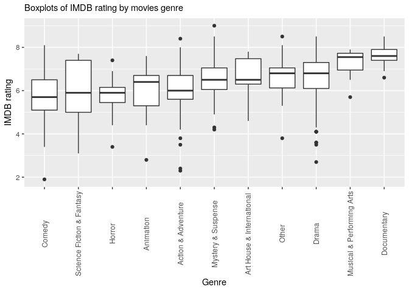
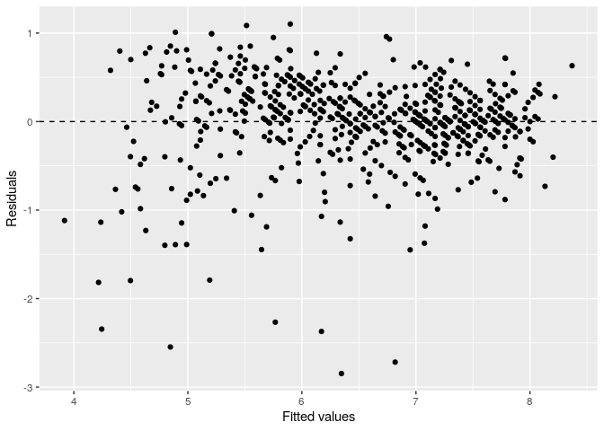

Modeling and prediction for movies
================

## Setup

### Load packages

``` r
library(ggplot2)
library(dplyr)
library(statsr)
```

### Load data

``` r
load("movies.Rdata")
```

-----

## Part 1: Data

The data set is comprised of 651 randomly sampled movies produced and
released before 2016. Because random sampling is implemented, the
results can be generalized. Since there isn’t random assignment,
causation is not possible.

-----

## Part 2: Research question

We will study the IMDB rating of a movie, and try to find associations
with a variety of other variables in the data set.

-----

## Part 3: Exploratory data analysis

Let’s do the first count:

``` r
dim(movies)
```

    ## [1] 651  32

Our dataset has 651 observations and 32 variables.

Let’s count now NA values for each column:

``` r
colSums(is.na(movies))
```

    ##            title       title_type            genre          runtime 
    ##                0                0                0                1 
    ##      mpaa_rating           studio    thtr_rel_year   thtr_rel_month 
    ##                0                8                0                0 
    ##     thtr_rel_day     dvd_rel_year    dvd_rel_month      dvd_rel_day 
    ##                0                8                8                8 
    ##      imdb_rating   imdb_num_votes   critics_rating    critics_score 
    ##                0                0                0                0 
    ##  audience_rating   audience_score     best_pic_nom     best_pic_win 
    ##                0                0                0                0 
    ##   best_actor_win best_actress_win     best_dir_win       top200_box 
    ##                0                0                0                0 
    ##         director           actor1           actor2           actor3 
    ##                2                2                7                9 
    ##           actor4           actor5         imdb_url           rt_url 
    ##               13               15                0                0

We will delete the corresponding rows from our dataset later, if
necessary.

Below the description of IMDB movie rating numerical variable:

``` r
summary(movies$imdb_rating)
```

    ##    Min. 1st Qu.  Median    Mean 3rd Qu.    Max. 
    ##   1.900   5.900   6.600   6.493   7.300   9.000

``` r
ggplot(movies, aes(y = imdb_rating)) + 
  geom_boxplot() +
  ggtitle("Box Plot of IMDB rating")
```

<!-- -->

As we can see the median is 6.6 and there are some outliers lower than
4.

Let’s check now the relationships between some of the variables in the
data set.

### IMDB rating and Rotten Tomatoes audience score

``` r
ggplot(data = movies, aes(x = audience_score, y = imdb_rating)) +
  geom_jitter()
```

<!-- -->

``` r
movies %>%
  summarise(cor(audience_score, imdb_rating))
```

    ## # A tibble: 1 x 1
    ##   `cor(audience_score, imdb_rating)`
    ##                                <dbl>
    ## 1                              0.865

There’s a quite strong linear relationship between the two variables.

### Runtime and Rotten Tomatoes audience score

``` r
movies_clean <- filter(movies,!is.na(runtime))
ggplot(data = movies_clean, aes(x = runtime, y = audience_score)) +
  geom_jitter()
```

<!-- -->

``` r
movies_clean %>%
  summarise(cor(runtime, audience_score))
```

    ## # A tibble: 1 x 1
    ##   `cor(runtime, audience_score)`
    ##                            <dbl>
    ## 1                          0.181

From the scatterplot and the correlation coefficient we can see a quite
low positive linear correlation between the two variables.

### IMDB number of votes and Rotten Tomatoes audience score

``` r
ggplot(data = movies, aes(x = imdb_num_votes, y = audience_score)) +
  geom_jitter()
```

<!-- -->

``` r
movies %>%
  summarise(cor(imdb_num_votes, audience_score))
```

    ## # A tibble: 1 x 1
    ##   `cor(imdb_num_votes, audience_score)`
    ##                                   <dbl>
    ## 1                                 0.290

In this case, as expected, there’s no clear linear relationship.

### Rotten Tomatoes critics score and audience score

``` r
ggplot(data = movies, aes(x = critics_score, y = audience_score)) +
  geom_jitter()
```

<!-- -->

``` r
movies %>%
  summarise(cor(critics_score, audience_score))
```

    ## # A tibble: 1 x 1
    ##   `cor(critics_score, audience_score)`
    ##                                  <dbl>
    ## 1                                0.704

There’s a quite strong positive linear correlation between the two
variable. We will consider this in doing the model later.

### Categorical variables and IMDB rating

Let’s plot now the relationship between the genre of a movie and the
IMDB rating numerical variable:

``` r
ggplot(data=movies,aes(x=reorder(genre,imdb_rating), y=imdb_rating)) +
  geom_boxplot() +
  labs(y="IMDB rating", x="Genre", subtitle="Boxplots of IMDB rating by movies genre") +
  theme(axis.text.x  = element_text(angle=90, vjust=0.5))
```

<!-- -->

Below we can see the relationship between the mpaa rating and the imdb
rating:

``` r
ggplot(data=movies,aes(x=reorder(mpaa_rating,imdb_rating), y=imdb_rating)) +
  geom_boxplot() +
  labs(y="IMDB rating", x="MPAA rating", subtitle="Boxplots of IMDB rating by MPAA rating") +
  theme(axis.text.x  = element_text(angle=90, vjust=0.5))
```

<!-- -->

-----

## Part 4: Modeling

In this part, we will develop a multiple linear regression model to
predict the **imdb\_rating** variable, our response variable, using
several explanatory variables.

### Choice of variables

Our response variable is **imdb\_rating**.

We will exclude from our candidate explanatory variables the following
variables because they are not meaningful in this context: title,
imdb\_url, rt\_url.

As we have seen in the previous chapter, audience\_score is collinear
with critics\_score. We can exclude critics\_score from the selected
variables.

Let’s analyse the relationship between imdb\_num\_votes and our response
variable:

``` r
movies %>%
  summarise(cor(imdb_num_votes, imdb_rating))
```

    ## # A tibble: 1 x 1
    ##   `cor(imdb_num_votes, imdb_rating)`
    ##                                <dbl>
    ## 1                              0.331

They are not so much correlated, hence we will exclude imdb\_num\_votes
from our selected columns.

Let’s analyse the relationship between runtime and our response
variable:

``` r
movies %>%
  filter(!is.na(runtime)) %>%
  summarise(cor(runtime, imdb_rating))
```

    ## # A tibble: 1 x 1
    ##   `cor(runtime, imdb_rating)`
    ##                         <dbl>
    ## 1                       0.268

They are not so much correlated, hence we will exclude runtime from our
selected columns.

As we have already seen in the previous chapter there is a quite strong
positive correlation between audience score and IMDBB rating, suggesting
that we could use the audience score on Rotten Tomatoes to predict the
IMDB rating.

Let’s create one variable named awarded with value ‘yes’ if one of the
following variables is ‘yes’, ‘no’ otherwise. We will include this new
variable in the model.

``` r
movies_reduced <- movies %>% 
  mutate(awarded = if_else(best_pic_nom == 'yes' | best_pic_win == 'yes' | best_actor_win == 'yes' | best_actress_win == 'yes' | best_dir_win == 'yes', 'yes', 'no'))
```

We will exclude also the following variables: title\_type, director,
actor1, actor2, actor3, actor4, actor5, studio, thtr\_rel\_year,
thtr\_rel\_month, thtr\_rel\_day, dvd\_rel\_year, dvd\_rel\_month,
dvd\_rel\_day.

Let’s select our candidates explanatory variables and our response
variable:

``` r
movies_reduced <- movies_reduced %>% select('imdb_rating','audience_score','genre','mpaa_rating','awarded','top200_box') 
```

Now let’s pick one of the observations to do the prediction later:

``` r
indices <- sample(1:nrow(movies_reduced), 1)
predict_movie <- movies_reduced[indices,]
movies_reduced <- movies_reduced[-indices,]
```

### Model selection

Our base multiple linear regression model is the following:

``` r
movie_rating_model <- lm(imdb_rating ~ audience_score + genre + mpaa_rating + awarded + top200_box, data = movies_reduced)
m_summary <- summary(movie_rating_model)
adj_r_squared <- m_summary$adj.r.squared
adj_r_squared
```

    ## [1] 0.7743595

It’s a quite hight adjusted \(R^2\).

Now, let’s perform backward selection in order to find the best model:

``` r
# Removing audience_score
movie_rating_model <- lm(imdb_rating ~ genre + mpaa_rating + awarded + top200_box, data = movies_reduced)
m_summary <- summary(movie_rating_model)
adj_r_squared_audience_score <- m_summary$adj.r.squared
adj_r_squared_audience_score
```

    ## [1] 0.2494515

``` r
# Removing genre
movie_rating_model <- lm(imdb_rating ~ audience_score + mpaa_rating + awarded + top200_box, data = movies_reduced)
m_summary <- summary(movie_rating_model)
adj_r_squared_genre <- m_summary$adj.r.squared
adj_r_squared_genre
```

    ## [1] 0.7563578

``` r
# Removing mpaa_rating
movie_rating_model <- lm(imdb_rating ~ audience_score + genre + awarded + top200_box, data = movies_reduced)
m_summary <- summary(movie_rating_model)
adj_r_squared_mpaa_rating <- m_summary$adj.r.squared
adj_r_squared_mpaa_rating
```

    ## [1] 0.7748032

``` r
# Removing awarded
movie_rating_model <- lm(imdb_rating ~ audience_score + genre + mpaa_rating + top200_box, data = movies_reduced)
m_summary <- summary(movie_rating_model)
adj_r_squared_awarded <- m_summary$adj.r.squared
adj_r_squared_awarded
```

    ## [1] 0.7704026

``` r
# Removing top200_box
movie_rating_model <- lm(imdb_rating ~ audience_score + genre + mpaa_rating + awarded, data = movies_reduced)
m_summary <- summary(movie_rating_model)
adj_r_squared_top200_box <- m_summary$adj.r.squared
adj_r_squared_top200_box
```

    ## [1] 0.7742338

The model obtained removing mpaa\_rating variable gives the best
adjusted \(R^2\), slightly better than the previous model with all the
selected variables.

Let’s remove mpaa\_rating and continue backward selection until we don’t
see any improvement in adjusted \(R^2\):

``` r
movie_rating_model <- lm(imdb_rating ~ audience_score + genre + awarded + top200_box, data = movies_reduced)
m_summary <- summary(movie_rating_model)
adj_r_squared <- m_summary$adj.r.squared
adj_r_squared
```

    ## [1] 0.7748032

Let’s perform backward selection:

``` r
# Removing audience_score
movie_rating_model <- lm(imdb_rating ~ genre + awarded + top200_box, data = movies_reduced)
m_summary <- summary(movie_rating_model)
adj_r_squared_audience_score <- m_summary$adj.r.squared
adj_r_squared_audience_score
```

    ## [1] 0.238839

``` r
# Removing genre
movie_rating_model <- lm(imdb_rating ~ audience_score + awarded + top200_box, data = movies_reduced)
m_summary <- summary(movie_rating_model)
adj_r_squared_genre <- m_summary$adj.r.squared
adj_r_squared_genre
```

    ## [1] 0.7518332

``` r
# Removing awarded
movie_rating_model <- lm(imdb_rating ~ audience_score + genre + top200_box, data = movies_reduced)
m_summary <- summary(movie_rating_model)
adj_r_squared_awarded <- m_summary$adj.r.squared
adj_r_squared_awarded
```

    ## [1] 0.7711869

``` r
# Removing top200_box
movie_rating_model <- lm(imdb_rating ~ audience_score + genre + awarded, data = movies_reduced)
m_summary <- summary(movie_rating_model)
adj_r_squared_top200_box <- m_summary$adj.r.squared
adj_r_squared_top200_box
```

    ## [1] 0.7747248

No improvements, so the best model is this one:

``` r
movie_rating_model <- lm(imdb_rating ~ audience_score + genre + awarded + top200_box, data = movies_reduced)
m_summary <- summary(movie_rating_model)
m_summary
```

    ## 
    ## Call:
    ## lm(formula = imdb_rating ~ audience_score + genre + awarded + 
    ##     top200_box, data = movies_reduced)
    ## 
    ## Residuals:
    ##      Min       1Q   Median       3Q      Max 
    ## -2.84685 -0.18737  0.05373  0.30572  1.10185 
    ## 
    ## Coefficients:
    ##                                 Estimate Std. Error t value Pr(>|t|)    
    ## (Intercept)                     3.576765   0.087678  40.794  < 2e-16 ***
    ## audience_score                  0.043794   0.001124  38.949  < 2e-16 ***
    ## genreAnimation                 -0.446736   0.183797  -2.431 0.015350 *  
    ## genreArt House & International  0.223343   0.152704   1.463 0.144073    
    ## genreComedy                    -0.164141   0.084910  -1.933 0.053664 .  
    ## genreDocumentary                0.438167   0.102386   4.280 2.16e-05 ***
    ## genreDrama                      0.175460   0.072637   2.416 0.015991 *  
    ## genreHorror                     0.170278   0.125700   1.355 0.176013    
    ## genreMusical & Performing Arts  0.185940   0.165076   1.126 0.260425    
    ## genreMystery & Suspense         0.385533   0.093722   4.114 4.41e-05 ***
    ## genreOther                      0.064959   0.144759   0.449 0.653773    
    ## genreScience Fiction & Fantasy -0.084374   0.183266  -0.460 0.645393    
    ## awardedyes                      0.158617   0.047335   3.351 0.000853 ***
    ## top200_boxyes                   0.151989   0.137511   1.105 0.269453    
    ## ---
    ## Signif. codes:  0 '***' 0.001 '**' 0.01 '*' 0.05 '.' 0.1 ' ' 1
    ## 
    ## Residual standard error: 0.5149 on 636 degrees of freedom
    ## Multiple R-squared:  0.7793, Adjusted R-squared:  0.7748 
    ## F-statistic: 172.8 on 13 and 636 DF,  p-value: < 2.2e-16

### Model diagnotics

We have already analysed the linear relationship between the
audience\_score numerical variable and the response variable, using a
scatter plot. Let’s check the condition of nearly normal residuals with
mean 0 using a histogram:

``` r
ggplot(data = movie_rating_model, aes(x = .resid)) +
  geom_histogram(binwidth = 0.05) +
  xlab("Residuals")
```

<!-- -->

``` r
summary(resid(movie_rating_model))
```

    ##     Min.  1st Qu.   Median     Mean  3rd Qu.     Max. 
    ## -2.84685 -0.18737  0.05373  0.00000  0.30572  1.10185

As we can see the distribution is a little left skewed with mean 0.

Now, let’s check the constant variability of residuals using a residuals
plot:

``` r
ggplot(data = movie_rating_model, aes(x = .fitted, y = .resid)) +
  geom_point() +
  geom_hline(yintercept = 0, linetype = "dashed") +
  xlab("Fitted values") +
  ylab("Residuals")
```

<!-- -->

We can see that the condition of constant variability is fairly
verified. Higher predicted values results in lower residuals and there
is more scatter in the lower part. These need to be further analysed.

Finally, because the data are sampled randomly, the observations are
independent and hence the residuals are independent.

### Interpretation of model coefficients

The p-value of the entire model is low, indicating that the model as a
whole is significant.

The p-value of the `audience_score` coefficient is low, indicating that
the variable is significant. The p-value of the other categorical
variables (genre, top200\_box and awarded) are relative to some of the
levels, so we can’t say they are not entirely significant if the p-value
of some levels are not low.

The estimate for the numerical variable `audience_score` is 0.04. It
reflects how much higher a group of movies is expected to be rated by
IMDB if they have a Rotten Tomatoes audience score that is one point
higher *while holding all other variables constant*.

-----

## Part 5: Prediction

The movie we want to predict the IMDB rating is:

``` r
predict_movie
```

    ## # A tibble: 1 x 6
    ##   imdb_rating audience_score genre mpaa_rating awarded top200_box
    ##         <dbl>          <dbl> <fct> <fct>       <chr>   <fct>     
    ## 1         7.3             76 Drama PG          yes     no

``` r
predict(movie_rating_model, predict_movie)
```

    ##        1 
    ## 7.239224

The IMDB rating prediction for the movie (6.59) is not far from the real
rating (6.9).

We can also construct a prediction interval around this prediction,
which will provide a measure of uncertainty around the prediction.

``` r
predict(movie_rating_model, predict_movie, interval = "prediction", level = 0.95)
```

    ##        fit      lwr      upr
    ## 1 7.239224 6.224339 8.254109

The model predicts, with 95% confidence, that a movie with an audience
score of 69, of genre Comedy, with mpaa rating PG-13, awarded, and that
don’t appears in the top200, is expected to have an imdb rating between
5.68 and 7.6.

-----

## Part 6: Conclusion

We found a significant model that explains 77.4% of the variability in
the dataset.

The predictions can be improved by adding new features not considered
here, or by considering a larger sample of movies with more recent data.
